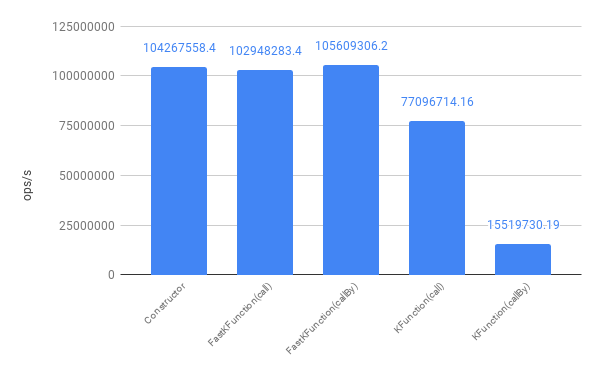

[](https://opensource.org/licenses/Apache-2.0)

[](https://codecov.io/gh/ProjectMapK/FastKFunction)

---

FastKFunction
===
`FastKFunction` is a wrapper library for fast calls to `KFunction`.

## Demo code
With just this description, you can call the `KFunction` faster.

```kotlin
data class Sample(
    val arg1: Int,
    val arg2: Int,
    val arg3: Int,
    val arg4: Int,
    val arg5: Int
)

val function: KFunction<Sample> = ::Sample

val fastKFunction: FastKFunction<Sample> = FastKFunction.of(function)

// call by vararg
val result: Sample = fastKFunction.call(1, 2, 3, 4, 5)

// call by Collection
val result: Sample = fastKFunction.callByCollection(listOf(1, 2, 3, 4, 5))

// call by ArgumentBucket
val result: Sample = fastKFunction.generateBucket()
        .apply { (0 until 5).forEach { this[it] = it + 1 }}
        .let { fastKFunction.callBy(it) }
```

## How Fast?
Calling the `constructor` is more than 1.2 times faster than calling `KFunction` with `call`,
and more than 6 times faster than calling it with `callBy`.

You can get the same speed as `reflection` in `Java`.

|                           | ops/s       |Ratio|
|---------------------------|------------:|-----|
| **Java Constructor**      |`104267558.4`|`6.7`|
| **FastKFunction(call)**   |`102948283.4`|`6.6`|
| **FastKFunction(callBy)** |`105609306.2`|`6.8`|
| **KFunction(call)**       | `77096714.2`|`5.0`|
| **KFunction(callBy)**     | `15519730.2`|`1`  |



_This score was measured with `Ryzen7 3700X`, `Windows10`, [3b8687](https://github.com/ProjectMapK/FastKFunction/tree/3b8687da712319a49e4f58a38edbb016cc0c41b7) committed code and benchmark settings._  
_It is currently a little faster with small improvements._

### Raw data, and other comparisons
You can get full benchmark score and some other graphs [here](https://docs.google.com/spreadsheets/d/1DJhf8KX1-BAxCGor5cZdlO3626AZbKeet-rkk26XGAE/).

### Mechanism
`FastKFunction` realizes high speed by the following ingenuity.

- Call `KFunction` with `call` if the argument is fully initialized.
 - If possible, call `Java` `Method` or `Constructor` directly for further speedup.
- Efficient retention of arguments and switching between `call`/`callBy` calls by devising a data structure.
- Avoid using `spread operator` as much as possible.

I have a blog post on the mechanism of fast invocation (in Japanese).

- [【Kotlin】KFunctionを高速に呼び出す（前編） \- Qiita](https://qiita.com/wrongwrong/items/f7b15d54956191f471d1)
- [【Kotlin】KFunctionを高速に呼び出す（後編） \- Qiita](https://qiita.com/wrongwrong/items/fe75bae3911eff319e68)

### Benchmarking
You can run the benchmark with the `./gradlew jmh`.  
It takes about 45 minutes to run a complete benchmark.

```bash
./gradlew jmh
```

## Installation
`FastKFunction` is published on JitPack.
You can use this library on `Maven`, `gradle` and any other build tools.
Please see here for the introduction method.

- [ProjectMapK / FastKFunction](https://jitpack.io/#ProjectMapK/FastKFunction)

## How to use FastKFunction

### Initialization
In some cases, `instance parameter` is required to initialize `FastKFunction`.
Even if the `instance parameter` is not required, passing it may speed up the process.

The following is the correspondence table.

|                                     | instance parameter | description                                                |
|:-----------------------------------:|:------------------:|------------------------------------------------------------|
|           **Constructor**           |     Unnecessary    |                                                            |
|        **Top level function**       |     Unnecessary    |                                                            |
|  **Method reference from instance** |      Optional      | Passing the `instance parameter` will speed up the call.   |
| **Function defined for the object** |      Optional      | Passing `instance parameter` will speed up initialization. |
| **Top level extension function**    |      Required      |                                                            |
| **Method reference from class**     |      Required      |                                                            |

Calling the `constructor` of an `inner class` or an `extension function` defined in an `instance` is currently not supported.

### How to call
`FastKFunction` supports two major types of calls.

#### Call by vararg or Collection
Calling with `vararg` or `Collection` is faster if you don't need to use the `default arguments` and
 can get them in the order in which they are defined.

```kotlin
val fastKFunction: FastKFunction<Sample> = FastKFunction.of(function)

// call by vararg
val result: Sample = fastKFunction.call(1, 2, 3, 4, 5)

// call by Collection
val result: Sample = fastKFunction.callByCollection(listOf(1, 2, 3, 4, 5))
```

#### Call by ArgumentBucket
If the `default argument` is expected to be used, a call using `ArgumentBucket` is available.

`ArgumentBucket` has interfaces like `MutableMap<KParameter, Any?>`, which can be used, for example, as follows.

```kotlin
data class Sample(
    val arg1: Int,
    val arg2: Int = 0,
    val arg3: String? = null
)

val fastKFunction: FastKFunction<Sample> = FastKFunction.of(::Sample)

fun map(src: Map<String, Any?>): Sample {
    return fastKFunction.generateBucket()
        .apply { 
            fastKFunction.valueParameters.forEach {
                if (src.containsKey(it.name!!)) this[it] = src.getValue(it.name!!)
            }
        }.let { fastKFunction.callBy(it) }
}
```

### For functions that can be called from a single argument
For a function that can be called with a single argument, you can use the `SingleArgFastKFunction`.

```kotlin
data class Sample(val arg: Int)

val fastKFunction: SingleArgFastKFunction<Sample> = SingleArgFastKFunction.of(::Sample)

val result: Sample = fastKFunction.call(1)
```
